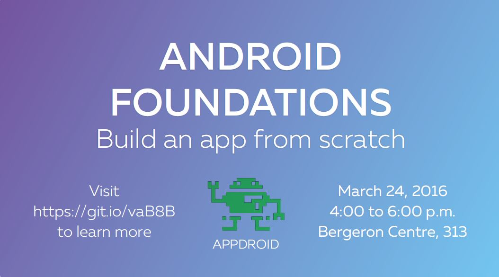

# Android Foundation Workshop Hosted By AppDroid
  
Hello!
 
In this workshop, we will build a simple Android app that will teach you the foundational knowledge to mobile development in Android. Stay tuned to find out what we will be building.

## Venue
Where?   Bergeron Centre, Room 313  
When?    4:00 – 6:00 pm on March 24, 2016  

## Agenda
3:30 – 4:00 pm   AppDroid team will help install Android Studio and/or BlueStacks  
4:00 – 4:30 pm   Setting up and understanding an Android project  
4:30 – 5:00 pm   Using XML to create the user interface  
5:00 – 5:30 pm   Editing activities to manipulate the user interface  
5:30 – 6:00 pm   Saving files to the user’s phone  

## Laptop Setup
To follow along the workshop, please do the following:  
1. Install Android Studio: http://developer.android.com/sdk/index.html  
2. Set up SDK Manager: http://developer.android.com/tools/help/sdk-manager.html  
3. Install BlueStacks (If you don't have an android phone): http://www.bluestacks.com/  

More detailed instructions are available written by Simon Ma: https://goo.gl/ZPwEOD

## FAQs
Q.  Do I need to know any programming?  
A.  Java programming is an asset, but it is not necessary. We will be going over the very basics of Android development.

Q.  What should I bring?  
A.  Bring yourself, your friends and your laptop. We encourage you to follow along in coding what may be your very first Android application! Remember to setup your laptop with the necessary programs. If you encounter any difficulty, come to the workshop a little earlier and we will help you set things up.

Q.  Where and when will it take place?  
A.  Please see venue information.

Q.  What if I have other questions?  
A.  Send an email to Jonathan or come over to our club room at 102C Bergeron Centre.

## Contact
Presenter:  
Jonathan Bahri – AppDroid Club @YU  
jonathan.bahri@outlook.com

Host:  
AppDroid  
yuappdroid@gmail.com
